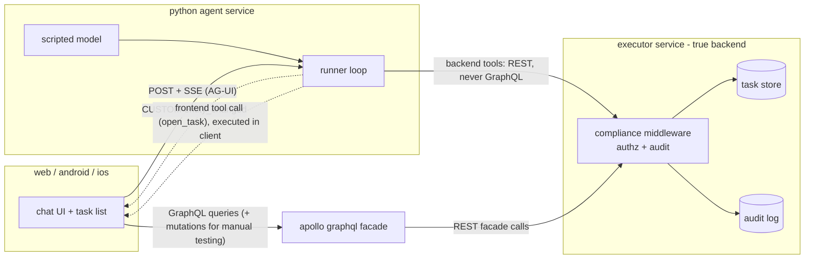

# apollo-agui-a2ui — hybrid chat-action MWE

A minimal working example of a **hybrid chat-action architecture**: an AG-UI
chat agent whose **backend tools** write through a true-backend "executor"
service (compliance middleware, audit log), while **frontend tools** execute
client-side — across **three clients** (React web, Kotlin Android, Swift iOS)
that reconcile their Apollo GraphQL caches via **`entity_changed` events**
instead of subscriptions. The model is **scripted and deterministic**: no API
keys, no external services, fully reproducible tests.

<p align="center">
  
</p>

## Architecture



The flow a newcomer should watch (it's what the e2e suite scripts):

1. You type **"add a task to buy milk"**. The client POSTs an AG-UI
   `RunAgentInput` to the agent and consumes the SSE stream.
2. The **scripted model** decides to call the backend tool `create_task`; the
   runner executes it against the **executor over REST — never GraphQL**. The
   executor's **compliance middleware** verifies identity headers, checks the
   `(caller, tool)` allowlist for that exact route, and **audits the write with
   your user id and the AG-UI run id**.
3. The agent emits a `CUSTOM entity_changed {typename, id, kind, scope}` event,
   then streams the confirmation text.
4. The client routes the event into its cache layer — web through Apollo
   Client's `RefetchEventManager`, mobile through an **invalidation bus** — and
   exactly the active task-list query refetches. The list updates **without a
   reload**, through the GraphQL facade, which itself reads via the executor.
5. **"open the milk task"** demonstrates the hybrid half: the agent calls the
   client-declared `open_task` tool, the run ends _deferred_, the client
   executes it locally (highlights the row), appends the tool result, and a
   continuation run streams text reflecting the client's answer. A client that
   didn't advertise `open_task` gets a capability-aware fallback instead.

The load-bearing contracts live in [`/contracts`](contracts/) — the
`entity_changed` schema, the frontend-tool declaration schema, canonical
fixtures, identity-header names, and recorded real-agent SSE transcripts.
**Every platform pins conformance tests to those files.**

## Repository layout

| Path                         | What                                                                                     | Tested by                 |
| ---------------------------- | ---------------------------------------------------------------------------------------- | ------------------------- |
| `contracts/`                 | Cross-platform source of truth (schemas, fixtures, transcripts)                          | vitest conformance        |
| `services/executor/`         | True-backend stand-in: task store, REST API, compliance middleware, audit log            | vitest (23)               |
| `services/graphql/`          | Apollo Server 5 facade over the executor REST API (owns no data)                         | vitest (19)               |
| `services/agent/`            | AG-UI SSE endpoint, scripted model, backend tools, `entity_changed`                      | pytest (40)               |
| `apps/web/`                  | React + Apollo Client 4.2 + raw `@ag-ui/client` chat, RefetchEventManager reconciliation | vitest (11)               |
| `apps/android/`              | Thin Compose + Apollo Kotlin shell over the Kotlin core                                  | build locally             |
| `apps/ios/`                  | Thin SwiftUI + Apollo iOS shell over the Swift core (XcodeGen)                           | build locally             |
| `apps/composer/`             | Custom A2UI composer shell: glossary DnD, iframe canvas, JSON drawer, Anthropic chat     | vitest (218)              |
| `apps/catalog/`              | Custom-styled A2UI basic-catalog renderer the composer iframes (+ DnD sidecar)           | vitest (77)               |
| `packages/a2ui-bridge/`      | Vendored renderer-side A2UI Preview Bridge (official composer repo, Apache-2.0)          | vendored — see its README |
| `packages/chat-core-kotlin/` | Pure-JVM AG-UI core: SSE parser, session/tool loop, invalidation bus                     | JUnit (20)                |
| `packages/chat-core-swift/`  | SwiftPM mirror of the Kotlin core, Linux-testable                                        | `swift test` locally      |
| `e2e/`                       | Scripted conversations against the live 3-service stack                                  | vitest (19)               |

## Prerequisites

| Tool                 | Version (pinned/tested)                    | Needed for                        |
| -------------------- | ------------------------------------------ | --------------------------------- |
| Node.js              | ≥ 22 (`.nvmrc`)                            | services, web, e2e                |
| pnpm                 | 10.x (`packageManager`)                    | workspace installs                |
| Python + uv          | 3.11+ / uv 0.8+                            | agent service                     |
| JDK                  | 21 (Gradle wrapper 8.14.3 included)        | Kotlin core (+ Android)           |
| Swift                | 6.x toolchain (package targets tools 5.10) | Swift core, iOS                   |
| Docker + compose     | 24+                                        | containerized bring-up (optional) |
| Android Studio / AGP | Ladybug+ / AGP 8.7.3                       | Android shell only                |
| Xcode + xcodegen     | 16+ / any recent                           | iOS shell only                    |

## Run it

```bash
git clone <this repo> && cd apollo-agui-a2ui
make setup        # pnpm install + uv sync
make dev          # executor + graphql + agent + web as local processes
# open http://localhost:7463 and type: add a task to buy milk
# then try: make the milk task high priority · tag the milk task as urgent
#           the milk task is due 2026-09-01 · clear my completed tasks · start over
```

Containerized alternative: `docker compose up --build` (same ports).

**Zero secrets:** auth is demo-grade but real in shape. A long-lived HS256 JWT
for `user-demo` (signed with the intentionally-public dev secret) is baked in
everywhere; the agent and the GraphQL facade verify it and forward identity
headers to the executor. Mint a token for another user any time:

```bash
node scripts/mint-dev-token.mjs alice alice@example.com "Alice Dev"
# web: paste into localStorage key `dev_jwt` (or set VITE_DEV_JWT); mobile: Config.kt / Config.swift
```

Watch the compliance story directly:

```bash
curl -s 'http://localhost:7460/audit' \
  -H 'x-caller-service: e2e' -H 'x-user-id: user-demo' -H 'x-tool-name: audit.read' | python3 -m json.tool
```

## Verify it

`make check` is the pre-push gate: lint + format-check + typecheck + every
package's tests + the e2e scenarios. `make e2e` runs the scripted
conversations of [handoff §4] on a freshly booted stack: backend write with
audit attribution, read-then-write, and the hybrid frontend-tool round trip
(advertised and not).

### Verification matrix (honest)

| Layer                      | Proven in-session by                                                                                                                                                                                         | Deferred to user machine                                                                |
| -------------------------- | ------------------------------------------------------------------------------------------------------------------------------------------------------------------------------------------------------------ | --------------------------------------------------------------------------------------- |
| executor / graphql / agent | unit + e2e suites; checked-in real SSE transcripts (`contracts/fixtures/transcripts/`, re-record via `make transcripts`)                                                                                     | —                                                                                       |
| web                        | component tests (exact refetch counts, tool loop over recorded transcripts) + Playwright-driven live-stack screenshots in `docs/screenshots/`                                                                | —                                                                                       |
| chat-core-kotlin           | `./gradlew test` (17 tests incl. MockWebServer transport)                                                                                                                                                    | Android app shell build/run                                                             |
| chat-core-swift            | — (egress policy blocked every Swift toolchain source in the authoring session; **code is not compile-verified**)                                                                                            | `swift test` (Linux or macOS), then iOS shell                                           |
| docker-compose             | `docker compose config` validation                                                                                                                                                                           | `docker compose up --build` (registry blob downloads were blocked in-session)           |
| android / ios shells       | code review only                                                                                                                                                                                             | build + run per app README                                                              |
| composer + catalog         | 86 + 23 vitest tests; live cross-frame Playwright drive (handshake, positional drag-drop via the sidecar, undo, mock-LLM apply, theme, SEND_TO_SERVER) with screenshots in `docs/screenshots/composer-*.png` | real-key Anthropic chat (bring your own key); Pages deploy (enable Pages, push to main) |

Full transcripts and the exact blocked-network details:
[docs/VERIFICATION.md](docs/VERIFICATION.md).

## How it scales

Thirteen backend tools now flow through the stack (create/complete/list plus
ten more probing bulk events, cross-entity + cross-scope writes, validation
and conflict edges, a schema field addition, and DELETED reconciliation).
The measured result — which layers grow linearly, which stay flat (the mobile
cores and the event protocol changed by **zero lines**), and the real
friction hit along the way — is written up in **[docs/SCALING.md](docs/SCALING.md)**.

## A2UI Composer (custom)

A second, self-contained initiative lives alongside the MWE: a greenfield
**A2UI composer** — a React shell ([apps/composer](apps/composer/)) hosting a
**custom-styled A2UI basic-catalog renderer** ([apps/catalog](apps/catalog/))
in a sandboxed iframe, the two speaking the **official A2UI Preview Bridge
protocol** (vendored at [packages/a2ui-bridge](packages/a2ui-bridge/)). You
compose A2UI v0.9 layouts three ways: drag glossary entries onto the live
canvas (precision drops via an additive `COMPOSERX_*` hit-test sidecar), edit
the layout JSON directly, or ask the **Anthropic-powered chat** — strictly
bring-your-own key, entered in the browser and kept in localStorage, so the
zero-secrets rule above still holds. The cross-cutting contract (message
shapes, ports, ids, deploy layout) is pinned in
[docs/composer/CONTRACT.md](docs/composer/CONTRACT.md); the app READMEs
([composer](apps/composer/README.md), [catalog](apps/catalog/README.md)) cover
the pane tour, the reskin mechanics, and BYO-renderer use.

```bash
make composer-dev                         # both dev servers, Ctrl-C stops both — or:
pnpm --filter @mwe/composer-catalog dev   # terminal 1 — renderer (port 7465)
pnpm --filter @mwe/composer dev           # terminal 2 — composer shell (port 7464)
# open http://localhost:7464
```

**Deploy:** every push to `main` touching the composer, catalog, or bridge
builds both apps and publishes them as **one GitHub Pages project site** —
composer at the root, catalog under `catalog/` (contract §9) — via
[.github/workflows/deploy-composer.yml](.github/workflows/deploy-composer.yml),
landing at <https://mbaker40.github.io/apollo-agui-a2ui/>. The workflow
self-enables Pages on its first run (`configure-pages` with
`enablement: true`); note GitHub Pages on a **private** repo requires a paid
plan — make the repo public or use the container path below otherwise. No
secrets to configure — visitors bring their own Anthropic key. The same site
also ships as a container:
[deploy/composer.Dockerfile](deploy/composer.Dockerfile) (multi-stage build →
Caddy, `PORT`-aware) runs on any container host; the Railway deployment uses
it with `RAILWAY_DOCKERFILE_PATH=deploy/composer.Dockerfile`. The deployed
composer also accepts an `http://localhost:…` renderer URL in Settings for
hybrid dev — browsers treat localhost as a trustworthy origin even inside an
HTTPS page.

## Design decisions (and divergences from the handoff doc)

- **Scripted model without an agent framework.** Instead of Pydantic AI's
  `FunctionModel`, the "model" is a ~150-line **pure step function**
  ([services/agent/src/agent/scripted_model.py](services/agent/src/agent/scripted_model.py))
  driven by a generic decide→tool→observe loop, speaking the official
  `ag-ui-protocol` types. Same shape as a real model loop, strictly less
  machinery, fully deterministic. A real model (the env-gated stretch goal —
  not implemented) would replace `next_action` behind the same interface.
- **Executor in TypeScript/Fastify**, not Scala: one runtime fewer, one-command
  setup preserved. The compliance middleware seam is the point, not the
  language ([services/executor/src/compliance.ts](services/executor/src/compliance.ts)).
- **Generated GraphQL types:** web uses none (a hand-written
  `TypedDocumentNode` for a 4-field schema beats a codegen pipeline); Android
  generates at build via the Apollo plugin; iOS generates via
  `apollo-ios-cli` and the output is git-ignored (it could not be generated in
  the authoring session — command in [apps/ios/README.md](apps/ios/README.md)).
  All three point at the canonical
  [services/graphql/schema.graphqls](services/graphql/schema.graphqls), which a
  facade test pins to the running SDL.
- **TypeScript pinned to 5.9** (not the new 7.x native compiler) and **rxjs to
  7.8.1** (exactly what `@ag-ui/client` ships, avoiding duplicate-instance type
  clashes).
- **Swift package targets swift-tools 5.10** so concurrency diagnostics stay
  warnings on first local build; bump to 6.0 after `swift test` passes for you
  (note in [Package.swift](packages/chat-core-swift/Package.swift)).

## Where production diverges

- **Real backend:** the executor stands in for the production Scala service.
  Keep the seam: callers authenticate end users, the backend verifies a
  _service_ credential (mTLS/signed token) instead of trusting identity
  headers, and the allowlist + audit live at the same choke point.
- **Real model:** swap `scripted_model.next_action` for an LLM call; the
  runner, tools, events, and clients don't change.
- **Tracing:** a Langfuse/OTel trace would wrap the runner loop — one span per
  run keyed by `run_id` (the same id the executor audits), one child span per
  tool call. The hook location is marked in
  [services/agent/src/agent/runner.py](services/agent/src/agent/runner.py).
- **A2UI:** out of scope here. It would layer on the same AG-UI stream —
  the agent emitting declarative UI payloads (e.g. as additional
  CUSTOM/generative-UI events) that clients render natively, alongside —
  not replacing — the `entity_changed` reconciliation.
- **Subscriptions upgrade path:** `entity_changed` deliberately rides the chat
  run's SSE stream (no fan-out infra). If cross-user liveness is needed later,
  move the same payload onto a GraphQL subscription/websocket topic keyed by
  `scope`; client reconciliation code stays identical.

## Troubleshooting

- **Port already in use** — the stack uses 7460–7463 (e2e uses 7480–7482, the
  transcript recorder 7490/7492). Override via `.env`/environment
  (`EXECUTOR_PORT`, …) or kill the stale process; every service fails fast.
- **CORS** — the agent allows `*` (FastAPI middleware) and Apollo standalone
  server defaults are permissive; if you proxy the web app elsewhere, keep the
  `authorization` header allowed.
- **401 from agent/graphql** — token expired or secret mismatch. Re-mint with
  `node scripts/mint-dev-token.mjs`; ensure `DEV_JWT_SECRET` matches across
  services (defaults do).
- **Android emulator can't reach the stack** — the host is `10.0.2.2`, not
  `localhost` (or `adb reverse tcp:7461 tcp:7461` + `tcp:7462`); physical
  devices need your LAN IP and the (already set) cleartext-dev flag. See
  [apps/android/README.md](apps/android/README.md).
- **iOS on a device** — use your LAN IP in `Config.swift`;
  `NSAllowsLocalNetworking` is already set for dev http.

[handoff §4]: e2e/src/scenarios.test.ts
