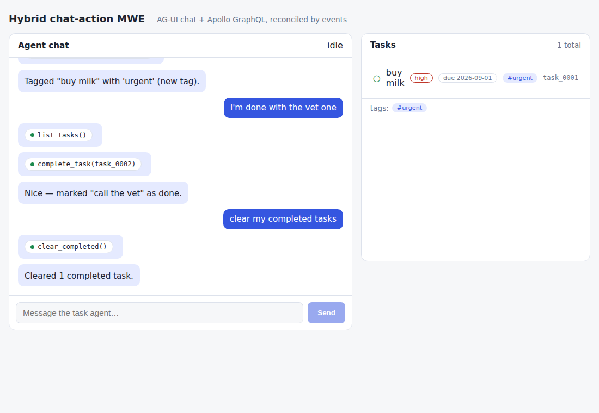

# How this architecture scales: the ten-mutation experiment

The question: what actually happens to the hybrid chat-action architecture
when the domain grows? The experiment: add **ten more mutations in one
sitting**, deliberately spread across scaling dimensions rather than ten
copies of `create_task` — then measure where the changes landed, what broke,
and what never moved.

| #   | Tool              | Dimension it probes                                      | Chat phrase                                         |
| --- | ----------------- | -------------------------------------------------------- | --------------------------------------------------- |
| 1   | `rename_task`     | baseline simple UPDATED (control)                        | "rename the milk task to buy oat milk"              |
| 2   | `set_due`         | field update + **validation edge** (400)                 | "the milk task is due 2026-09-01" / "…due tomorrow" |
| 3   | `set_priority`    | **schema field addition** (migration ripple)             | "make the milk task high priority"                  |
| 4   | `reopen_task`     | inverse state transition + no-op edge                    | "actually I'm not done with the milk one"           |
| 5   | `delete_task`     | first real **DELETED** producer (evict+gc)               | "delete the vet task"                               |
| 6   | `duplicate_task`  | CREATED derived from an existing entity                  | "duplicate the milk task"                           |
| 7   | `clear_completed` | **bulk: N events in one run** + empty edge               | "clear my completed tasks"                          |
| 8   | `create_tag`      | **new entity + new scope** + conflict edge (409)         | "add a tag called urgent"                           |
| 9   | `tag_task`        | **cross-entity write**, auto-create → 2 events, 2 scopes | "tag the milk task as urgent"                       |
| 10  | `reset_demo`      | cross-scope bulk delete                                  | "start over"                                        |

## Where the changes landed (the ripple table)

| Layer                           | What ten mutations cost                                                                                                                                | Shape of growth                              |
| ------------------------------- | ------------------------------------------------------------------------------------------------------------------------------------------------------ | -------------------------------------------- |
| **executor**                    | ~11 routes + store methods, 24 allowlist rows (agent + graphql callers), validation logic                                                              | **linear**, boilerplate-y but mechanical     |
| **graphql facade**              | 10 mutations + `Tag` type + `Priority` enum + `tags` query; `schema.graphqls` regenerated (pinned by test)                                             | **linear** in operations                     |
| **agent — tool registry**       | one `BackendToolSpec` per tool: an executor call + a `changes()` deriving 0..N `entity_changed` payloads (`services/agent/src/agent/backend_tools.py`) | **~10 lines per tool** after the v2 refactor |
| **agent — scripted model**      | one regex route + one handler each; most handlers are a single `_single_task_flow(...)` call                                                           | linear, but see _router fragility_ below     |
| **web**                         | **one registry line** (`Tag → ['tags']`), query fields, badges/strip UI                                                                                | reconciliation core untouched                |
| **mobile cores (Kotlin/Swift)** | **zero source changes** — new transcripts replay through the existing parser/session/bus                                                               | **flat**                                     |
| **contracts**                   | zero schema changes — `entity_changed` was already generic over typename/kind/scope                                                                    | **flat**                                     |
| **e2e / fixtures**              | one scripted-conversation file; 3 new recorded transcripts                                                                                             | linear in scenarios                          |

The two flat rows are the architecture's core claim holding under load: the
**event protocol and the client chat/reconciliation machinery are closed
over domain growth**. Ten new server-side behaviors reached three clients by
replaying bytes, not by porting code. The generic machinery that made it so:

- events are `(typename, id, kind, scope)` — nothing entity-specific;
- the web registry maps typename → list fields (one line per typename);
- mobile screens subscribe by scope, so a **new scope** (`tags`) is a new
  subscription in a shell, not a core change;
- a run may carry **any number** of events (bulk + cross-scope came free).

## Friction actually hit (not hypothesized)

1. **Keyword-intent routing is the first thing that breaks.** The new
   scenarios exposed a real collision: _"I'm done with the **copy** one"_ was
   swallowed by the `duplicate|copy` intent and duplicated the task instead
   of completing it (caught by e2e, fixed by verb-anchoring, pinned by a
   router-guard test). Ordered-regex routing accumulates constraints
   (`reset`/`clear` before `complete`, `create-tag` before `add`, `reopen`
   before `complete`…) that grow quadratically in reviewer attention. This is
   a property of the _scripted stand-in_, not the architecture: a real model
   replaces `next_action` wholesale and the entire pipeline behind it —
   registry, runner, events, clients — is unaffected.
2. **The allowlist doubles per caller.** Route-level authz stayed 1:1
   (`(caller, tool) → route`) because each tool got its own route; a generic
   `PATCH /tasks/:id` would have needed per-tool **body** validation in the
   compliance middleware to be equally strong. At ~100 tools the review
   burden of the table is the cost center; generate it from a manifest and
   diff it in CI.
3. **Error taxonomy pays for itself immediately.** Splitting executor
   failures into _4xx → structured tool-error result_ (model answers in
   prose; run finishes; audit shows `allowed`/`400|409`) vs _transport/5xx →
   `RUN_ERROR`_ meant ONE generic model rule handled the bad-date, duplicate-
   tag, and not-found edges — no per-tool error prose. This is the pattern
   real agent loops use, demonstrated deterministically.
4. **Bulk runs don't storm the network — within a round-trip.** Back-to-back
   `entity_changed` events coalesce through Apollo's in-flight query
   deduplication (pinned by a component test: 2 DELETED → 1 refetch). Events
   spaced wider than a round-trip refetch once each; a production app with
   chatty bulk tools would still add a small debounce in the
   `RefetchEventManager` handler (and the mobile bus consumers).
5. **Generated artifacts fight formatters.** Prettier rewrote the generated
   `schema.graphqls` and broke its byte-equality pin against `printSchema`;
   generated files need explicit formatter exemptions.
6. **Multi-scenario e2e demands state discipline.** Vitest's file order is
   not stable; both scenario files now open with `reset_demo` and capture
   entity ids from events instead of hardcoding them. (The executor
   deliberately never reuses ids, so caches can't confuse a deleted entity
   with a successor.)

## The recipe: adding mutation #11

1. **executor**: store method + route (+ validation) + two allowlist rows + tests.
2. **graphql**: mutation field + resolver + client method; `pnpm --filter
@mwe/graphql print-schema` (the pin test enforces you did).
3. **agent**: one `BackendToolSpec` (call + `changes()`); one intent regex +
   handler (usually one `_single_task_flow` call) + canned texts; unit tests.
4. **web**: nothing, unless a new typename → one registry line (+ UI).
5. **mobile**: nothing, unless a new scope → subscribe in the screen that renders it.
6. **e2e**: one scripted conversation step; re-record a transcript if the
   scenario is protocol-novel (`make transcripts`).

Roughly 60–120 lines end-to-end for a typical mutation, none of it in the
protocol or client cores.

## What would break first at 100 tools

- the regex router (replace with a real model — designed-for seam);
- allowlist/table review burden (generate from a manifest, diff in CI);
- one flat `backend_tools.py` / `Mutation` type (split by domain module);
- per-run SSE as the only event channel: cross-user/live updates would move
  the same `entity_changed` payload onto a subscription topic keyed by
  `scope` — clients' reconciliation code is already written for that shape.
