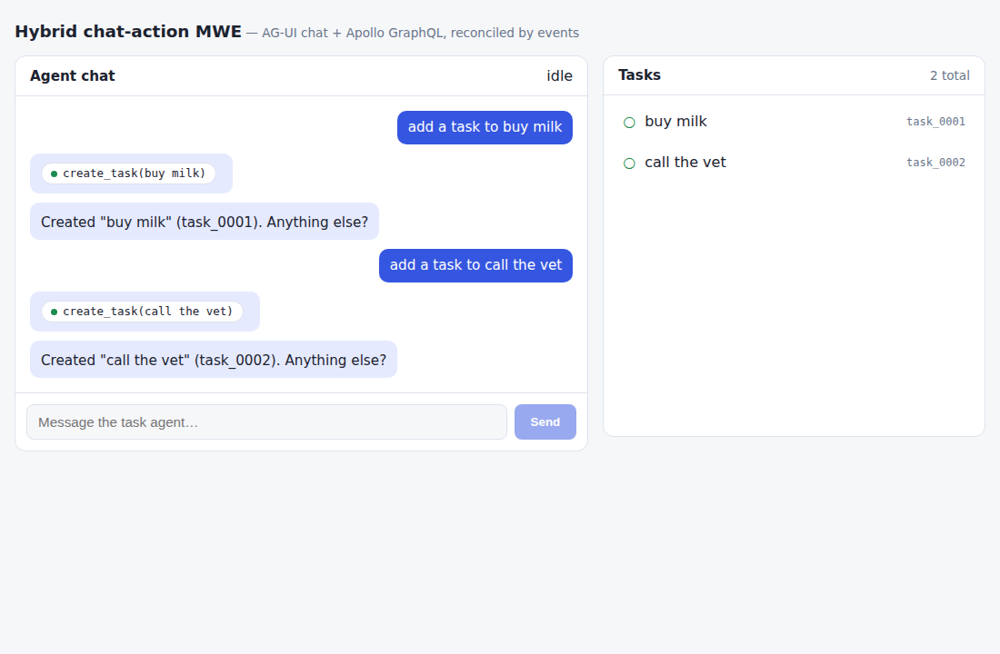
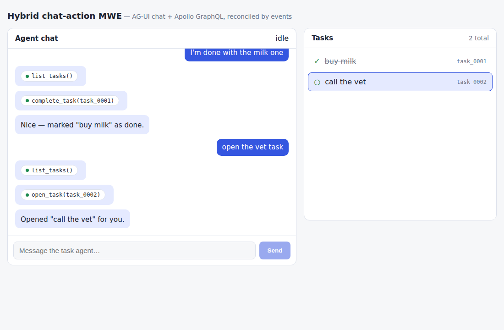

# Verification record

> **v2 addendum (same session, later):** after the ten-mutation scaling
> experiment ([SCALING.md](SCALING.md)) the in-session totals are:
> contracts 7, executor 23, graphql 6, agent 40 (pytest), web 11, Kotlin 20
> (all replaying the 9 recorded transcripts), e2e 19 — `make check` green.
> Swift gained mirrored v2 transcript tests (still verify-locally).
> Live v2 drive: `screenshots/web-v2-mutations.png`.

Captured in the authoring session (2026-08-29, Linux container, no secrets).
Everything below is reproducible with the listed commands; the two exceptions
(Swift, Docker image builds) are explained under **Network constraints**.

## `make check` — the full gate

```
$ make check
pnpm lint                                → eslint, clean
pnpm format:check                        → "All matched files use Prettier code style!"
uv run ruff check .                      → "All checks passed!"
./gradlew -q spotlessCheck               → clean
pnpm typecheck                           → tsc --noEmit clean in contracts, executor, graphql, web, e2e
uv run mypy src                          → "Success: no issues found in 8 source files"
pnpm -r --if-present test:
  @mwe/contracts     Tests  7 passed (7)
  @mwe/executor      Tests 11 passed (11)
  @mwe/graphql       Tests  5 passed (5)
  @mwe/web           Tests  8 passed (8)
uv run pytest -q                         → 22 passed
./gradlew -q test                        → 17 tests PASSED
swift test                               → SKIPPED (no toolchain in-session; see below)
pnpm --filter @mwe/e2e e2e               → Tests 6 passed (6)
check: all green
```

## E2E scenarios (handoff §4) against the live stack

`make e2e` boots executor + graphql + agent as real processes and runs
[`e2e/src/scenarios.test.ts`](../e2e/src/scenarios.test.ts):

- **auth gate**: agent and GraphQL both 401 without a valid bearer token.
- **scenario 1 — backend write**: SSE contains `TOOL_CALL_*` for
  `create_task`, exactly one `CUSTOM entity_changed {kind: CREATED}`, and the
  streamed confirmation; GraphQL `tasks` returns the row; the executor audit
  log attributes the write to `user-demo` **and** `run_e2e_1` with
  `entityId task_0001, status 201`.
- **scenario 2 — read-then-write**: `list_tasks` → `complete_task`,
  `entity_changed UPDATED`, GraphQL shows `completed: true`, both tool calls
  audited under `run_e2e_2`.
- **scenario 3 — hybrid tool**: with `open_task` advertised the run ends
  deferred (no result for the call, no text); the simulated client executes the
  tool and the continuation run streams `Opened "buy milk" for you.`; nothing
  reaches the executor for either run. Without the capability: zero tool
  calls and the fallback text.

Scenario 4 (web reconciliation) is component-level in
[`apps/web/test/reconcile.test.tsx`](../apps/web/test/reconcile.test.tsx):
CREATED/UPDATED refetch **exactly** the mounted watched query (fetch-count
asserted), a never-fetched query triggers **zero** requests, unmount stops
refetching, DELETED evicts from the cache. Scenario 5 (mobile cores) is the
Kotlin/Swift suites replaying the recorded transcripts below.

## Recorded real-agent SSE transcripts

[`contracts/fixtures/transcripts/`](../contracts/fixtures/transcripts/) was
recorded from the live executor+agent stack by
[`scripts/record-transcripts.mjs`](../scripts/record-transcripts.mjs)
(`make transcripts` re-records). They double as the `curl -N` proof — e.g.:

```
$ curl -N http://localhost:7462/agui -H 'content-type: application/json' \
    -H "authorization: Bearer $(node scripts/mint-dev-token.mjs)" \
    -d '{"threadId":"t","runId":"r1","state":null,"context":[],"forwardedProps":null,"tools":[],
         "messages":[{"id":"u1","role":"user","content":"add a task to buy milk"}]}'
data: {"type":"RUN_STARTED","threadId":"t","runId":"r1"}
data: {"type":"TOOL_CALL_START","toolCallId":"r1_call_1","toolCallName":"create_task","parentMessageId":"r1_msg_2"}
data: {"type":"TOOL_CALL_ARGS","toolCallId":"r1_call_1","delta":"{\"title\": \"buy milk\"}"}
data: {"type":"TOOL_CALL_END","toolCallId":"r1_call_1"}
data: {"type":"TOOL_CALL_RESULT","messageId":"r1_msg_3","toolCallId":"r1_call_1","content":"{...task json...}","role":"tool"}
data: {"type":"CUSTOM","name":"entity_changed","value":{"typename":"Task","id":"task_0001","kind":"CREATED","scope":"tasks"}}
data: {"type":"TEXT_MESSAGE_START","messageId":"r1_msg_4","role":"assistant"}
data: ... deltas ...
data: {"type":"RUN_FINISHED","threadId":"t","runId":"r1"}
```

The six checked-in transcripts cover: create, read-then-complete, deferred
`open_task`, its continuation, the capability fallback, and `RUN_ERROR` with
the executor down. The Kotlin and Swift test suites replay these exact files.

## Live web app (Playwright-driven)

The full stack was booted with `make dev` and driven in real Chromium:
"add a task to buy milk" / "add a task to call the vet" → rows appear via
event-driven refetch (no reload); "I'm done with the milk one" → strike-through
via UPDATED; "open the vet task" → the frontend tool executes in the browser
and highlights the row, and the agent's follow-up reflects the client result.




## Network constraints hit in the authoring session

The session's egress policy denied CONNECT (HTTP 403 at the proxy) to:

- `download.swift.org` — every official Swift-for-Linux toolchain tarball.
- `production.cloudfront.docker.com` — Docker Hub **blob** storage (manifest
  negotiation succeeded; layer downloads did not), which blocks both
  `docker pull swift:…` and `docker compose up --build` base images.

Consequences, stated plainly:

- **`chat-core-swift` is not compile-verified.** The package was
  review-checked and mirrors the tested Kotlin core 1:1 against the same
  fixtures, but until `swift test` runs on your machine treat it as unproven.
  It deliberately targets swift-tools 5.10 so strict-concurrency issues, if
  any, surface as warnings rather than hard errors.
- **`docker-compose.yml` is validated (`docker compose config`) but a full
  `docker compose up --build` was not run.** The process-based `make dev`
  path is the in-session-verified bring-up.

Both are marked in the README's verification matrix.

## Repo hygiene

After the full build + test cycle above, `git status` is clean — the root
`.gitignore` covers node_modules, dist, coverage, `.venv`, `__pycache__`,
Gradle/Android artifacts, SwiftPM `.build`, Xcode noise, env files, the
executor's local data dir, and the generated iOS GraphQL package.

## Composer initiative addendum (custom A2UI composer)

Proven in this authoring session:

- **Unit/component**: composer 86 vitest tests (surface-doc ops, bridge-host
  origin/buffering/handshake, store, JSON extraction, system prompt, drawer
  and chat flows, Anthropic client against a mocked SDK), catalog 23 (usages
  schema-validation against the real renderer zod schemas, sidecar hit-test
  math, app smoke).
- **Live cross-frame drive** (Playwright + the preinstalled chromium against
  both dev servers, composer 7464 ↔ catalog 7465): renderer handshake with
  the `?origin=` pairing; the welcome layout rendered inside the iframe;
  glossary populated with all 18 components; `COMPOSERX_SIDECAR_READY`
  observed; **positional drag-and-drop of a Button through the sidecar**
  (remapped `-g<n>` id landed in the layout JSON and rendered); undo;
  mock-LLM chat stream applied on completion and rendered; theme toggle
  flipping shell AND renderer to dark; an in-canvas button click surfacing
  as `SEND_TO_SERVER` in the events drawer. Screenshots:
  `docs/screenshots/composer-{light,chat-applied,dark}.png`.
- **Seed-payload schema conformance**: the welcome layout, recorded-mock
  payload, and empty doc all validate against `@a2ui/web_core`'s actual
  component schemas (strict zod; one bad component rejects a whole update).
- **Pages tree**: both apps built with the production base paths, assembled,
  and served locally — asset URLs and the `catalog/catalog` fetch path all
  returned 200.

Deferred to the user:

- **Real Anthropic chat** needs a real API key (Settings gear; browser-direct
  calls). The streaming/error/abort paths are unit-tested against the mocked
  SDK; the recorded mock covers the UI flow end-to-end without a key.
- **Actual GitHub Pages deploy**: enable Pages (Settings → Pages → Source:
  GitHub Actions) once; the workflow ships on push to main.
- **Our catalog inside the official hosted composer**: run
  `pnpm --filter @mwe/composer-catalog dev` and paste
  `http://localhost:7465/` as the renderer URL (not exercised in-session —
  the hosted composer's origin wasn't reachable through the session proxy).

### Figma-mode editing addendum

The second composer milestone (visual glossary tiles, canvas selection +
Design inspector, edit/preview modes, dashed drop indicators) was verified
the same way:

- Units: composer 161 vitest tests (inspector widgets/commit paths, prop-op
  guards, remove rules, sidebar tabs, shortcuts), catalog 52 (prop-spec
  derivation against the real zod schemas, veil/selection/mode handling,
  dashed indicator styling).
- Live Playwright drive (13 checks): handshake; 18 visual tiles; sidecar v2
  announce; positional drag under the edit veil; undo; **canvas
  click-to-select opening the Design inspector** (deepest component wins —
  clicking the CTA selects its label Text); **text-prop commit re-rendering
  the canvas as exactly one undo step** (a double-snapshot bug found by this
  drive was fixed in `store.commitProp` with an unchanged-value guard);
  inspector Delete removing a subtree and undo restoring it; preview mode
  restoring live components (SEND_TO_SERVER observed) and edit mode
  re-engaging; Chat-tab mock apply; theme propagation; **dashed drop
  indicators drawn during a DND hover** (insertion caret + container
  outline, captured on a catalog-solo page). Screenshots:
  `composer-inspector.png`, `composer-dnd-indicator.png`, plus refreshed
  `composer-{light,chat-applied,dark}.png`.
- Compatibility guard: the sidecar's default mode is preview, so the catalog
  stays a fully interactive standard renderer under COMPOSERX-unaware hosts
  (official hosted composer); our composer switches it to edit in every
  handshake.

### Moving placed components addendum

- Units: composer 218 vitest tests (moveComponent/canMoveTo semantics incl.
  the canonical after-removal reorder `[a,b,c]` a→index 2 → `[b,c,a]`,
  tree-drop thirds resolution, MOVE_* routing/store flows), catalog 77
  (lift-anchor climb, subtree-excluded target resolution, veil gesture
  flows: sub-threshold click stays SELECT, threshold drag posts
  MOVE_START/DROP with no SELECT, Escape cancels).
- Live Playwright drive (5 checks): a REAL mouse press-drag inside the
  canvas moved the welcome CTA above the title (mid-drag ghost + dimmed
  origin + dashed indicators captured in `composer-canvas-move.png`;
  visual order asserted by bounding boxes), one undo restored the order;
  a layout-tree drag moved a row via the upper-third zone with the dashed
  insertion indicator shown (`composer-tree-drag.png`); dragging the Card
  onto its own child Column rendered no-drop and the refused drop left
  the document byte-identical.

### Mobile web addendum

Audit at a phone viewport (390×844, DPR 3, touch) found the canvas/iframe
collapsed to 0px (fixed 250px + 330px panels), 190px horizontal page
scroll, tap targets under 44px, sub-16px inputs, `100vh`, and HTML5 drag
never firing from touch. After the §7b implementation, the same emulation
passes 8 live checks: no horizontal scroll with a full-width (372px)
iframe and the four-tab bar; all views reachable with the renderer iframe
KEPT AS THE SAME DOM NODE across switches (no handshake replay); drawer
default-closed; tap-to-insert with the "Button → #root" toast and
auto-switch to Canvas; **positional insert via the tile drag-grip's
pointer gesture** (ghost, live dashed indicators over the canvas, sidecar
target honored); the §4e canvas-move press-drag reorder working in the
mobile layout; canvas tap-select opening the Design view; all inputs at
16px (no iOS zoom-on-focus). Screenshots:
`composer-mobile-{canvas,add,grip-drag,design}.png`. Composer suite now
255 vitest tests. Tree-row drag remains desktop-only (documented).

### Selection overhaul addendum (ancestor honing + marquee/multi-select)

- Units: composer 320 vitest tests (ancestor chain + repeat-tap cycling
  walk/wrap/resets, breadcrumb/parent button, tree follow, selection-list
  semantics, additive×cycling guards, marquee replace, group-delete
  partition/subsumption/skip, SET_SELECTION {id, ids} sends), catalog 103
  (marquee candidates topmost-intersecting rule, veil gesture matrix incl.
  long-press-vs-lift arbitration, multi-outline rendering).
- Live drive, 11 checks (desktop + phone emulation): repeat-click walked
  label → Button → Column → Card at one spot; breadcrumb jump + parent
  button; a background marquee drag drew the band with 2 live candidates
  and selected both root siblings (2 outlines drawn iframe-side); group
  delete removed both and ONE undo restored both; shift-click built an
  additive pair; multi-panel Clear; on mobile two long-presses built a
  2-selection without leaving the canvas view and a plain tap landed in
  the Design view with the full breadcrumb for honing. Screenshots:
  composer-marquee.png, composer-multiselect.png,
  composer-mobile-multiselect.png.
- Known interplay: on mobile, plain-tap auto-opens the Design view, so
  repeat-tap cycling is effectively a desktop affordance — the breadcrumb
  (which the tap lands on) is the mobile honing tool by design.

### Group move addendum (drag a selection member, the whole selection moves)

- Units: catalog 121 vitest tests (group-lift decision from the stored
  SET_SELECTION ids incl. snapshot-at-lift and singleton/non-member
  fallbacks, union subtree exclusion in resolveDropTarget, count ghost
  label, per-member origin dims, unchanged MOVE_CANCEL/long-press timing,
  SIDECAR_READY v5), composer 363 (moveComponents document-order
  contiguous insertion / subsumption / skipped / clamp / refusal matrix,
  canMoveGroupTo, partitionForMove, non-collapsing MOVE_START, group
  MOVE_DROP = one undo + skipped toast, groupMoveIndexFor tree math,
  member vs non-member tree drags, movableUnitOf additive-select
  anchoring).
- Live drive, 12 checks (desktop + phone emulation): a marquee pair then a
  member press-drag showed the "2 components" ghost with BOTH origins
  dimmed and dropped both as one contiguous document-order run before the
  card title — ONE undo restored both; a non-member press single-lifted
  ("Text", one dim) and collapsed the selection, Escape cancelled cleanly;
  a tree drag on a selected row group-moved the whole pair into
  welcome-body (one undo); on mobile two long-presses built the pair and
  an immediate member drag moved BOTH buttons into the card. Screenshots:
  composer-group-move.png, composer-mobile-group-move.png.
- Contract delta found by the mobile drive: additive selects (long-press /
  shift-click) now toggle the MOVABLE UNIT (§4e lift-anchor rule — a
  Button's label toggles the Button), because a selection of slot-bound
  labels could neither group-move nor group-delete; plain-tap cycling,
  the breadcrumb, and the tree still reach slot occupants for prop edits.
